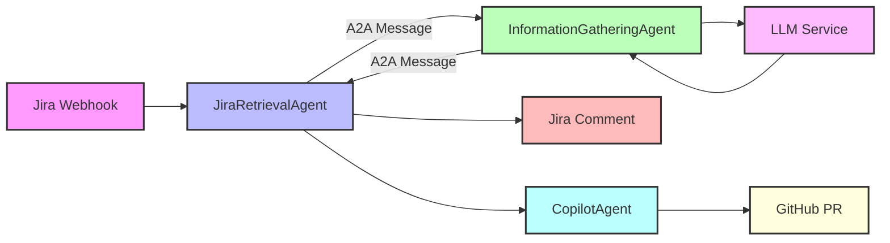
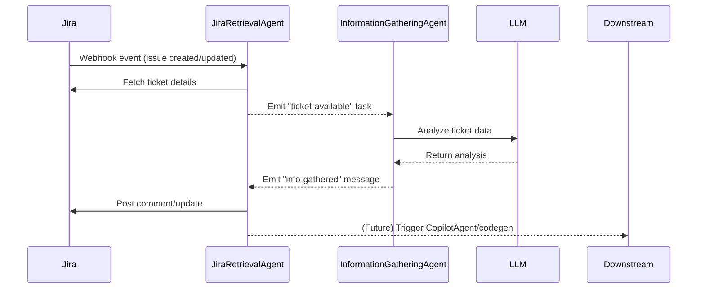

# Jira A2A System Documentation

## Overview

The Jira A2A system is a DevOps workflow automation platform using the tRPC-A2A-Go framework. It consists of independent Go agents that communicate via A2A messages, each implementing the standard TaskProcessor interface.

The system automates development workflows by:
1. Monitoring Jira tickets through webhooks
2. Analyzing ticket information with AI assistance
3. Generating code implementations for tickets (planned)
4. Creating GitHub pull requests with implemented solutions (planned)

## System Architecture



## System Sequence Diagram

The following Mermaid sequence diagram illustrates the step-by-step message flow between major system components:



### Key Components

- **JiraRetrievalAgent**: Handles Jira webhook events, extracts ticket information, coordinates with other agents, and posts analysis results back to Jira.
- **InformationGatheringAgent**: Analyzes ticket information, integrates with LLM for intelligent analysis, generates insights and recommendations, and returns structured analysis results.
- **CopilotAgent** (Planned): Receives implementation requirements, integrates with GitHub Copilot API, generates code, and creates pull requests.
- **LLM Integration**: Provides AI-powered analysis, generates summaries and insights, identifies missing information, and recommends next actions.

## System Workflow

1. **Webhook Reception**: JiraRetrievalAgent receives a webhook from Jira
2. **Data Extraction**: JiraRetrievalAgent extracts ticket details
3. **Task Creation**: JiraRetrievalAgent creates a "ticket-available" task
4. **Analysis Request**: JiraRetrievalAgent sends the task to InformationGatheringAgent
5. **Information Analysis**: InformationGatheringAgent processes the task with LLM assistance
6. **Results Return**: InformationGatheringAgent returns structured insights to JiraRetrievalAgent
7. **Jira Update**: JiraRetrievalAgent posts a comment to the Jira ticket
8. **Code Implementation**: (Future) JiraRetrievalAgent triggers CopilotAgent for code generation
9. **Pull Request Creation**: (Future) CopilotAgent creates a GitHub pull request

## Current Implementation Status

- **JiraRetrievalAgent**: Fully implemented (webhook handling, Jira API integration, task coordination)
- **InformationGatheringAgent**: Fully implemented (task processing, LLM integration, analysis generation)
- **CopilotAgent**: Planned, not implemented

## Component Details

### JiraRetrievalAgent

**Purpose**: Handles Jira webhooks, coordinates agents, and updates Jira tickets.

**Key Functions**:
- Processes incoming Jira webhook events
- Retrieves ticket information from Jira API
- Transforms Jira data into structured tasks
- Sends tasks to the InformationGatheringAgent
- Posts analysis results back to Jira tickets

**Webhook Example**:
```json
{
  "timestamp": 1714824000000,
  "webhookEvent": "jira:issue_created",
  "issue_event_type_name": "issue_created",
  "user": {
    "accountId": "5d1234567890abcdef123456",
    "displayName": "Alice Example"
  },
  "issue": {
    "id": "10002",
    "key": "PROJ-456",
    "fields": {
      "summary": "Cannot log in to the system",
      "description": "User reports being unable to log in with correct credentials.",
      "issuetype": { "name": "Bug" },
      "priority": { "name": "High" }
    }
  }
}
```

### InformationGatheringAgent

**Purpose**: Analyzes ticket information to provide structured insights and recommendations.

**Key Functions**:
- Receives "ticket-available" tasks from JiraRetrievalAgent
- Processes ticket data using LLM for analysis
- Generates structured insights and recommendations
- Returns analysis results to JiraRetrievalAgent

**Analysis Example**:
```json
{
  "ticketId": "PROJ-123",
  "analysisResult": {
    "keyThemes": "authentication, login, security",
    "riskLevel": "high",
    "priority": "high",
    "technicalImpact": "Users unable to access the system, potential security issue",
    "businessImpact": "Loss of productivity, customer frustration",
    "suggestedComponents": "auth-service, user-management",
    "missingInformation": "Browser details, error messages, steps to reproduce"
  },
  "summary": "This appears to be a critical login issue affecting users' ability to access the system. It's likely related to the authentication service and should be addressed with high priority."
}
```

### LLM Integration

- Integrates with OpenAI API (or alternative LLM providers)
- Implements prompt engineering for consistent analysis
- Handles API communication, rate limiting, and error handling
- Extracts structured data from LLM responses

**Configuration Example:**
```
LLM_ENABLED=true
LLM_PROVIDER=openai
LLM_MODEL=gpt-4
LLM_API_KEY=your-openai-api-key
LLM_MAX_TOKENS=4000
LLM_TEMPERATURE=0.0
```

## Running the Application

### Using Make
```bash
make run-all       # Start all agents
make run-info      # Start InformationGatheringAgent
make run-jira      # Start JiraRetrievalAgent
make logs-all      # View all logs
make stop-all      # Stop all agents
```

### Using Docker Compose
```bash
docker-compose up -d
```

### Manually
```bash
# Start InformationGatheringAgent
cd cmd/infogathering
go build
./infogathering

# Start JiraRetrievalAgent
cd cmd/jiraretrieval
go build
./jiraretrieval
```

## Testing

### Simulating a Jira Webhook
```bash
curl -X POST http://localhost:8081/webhook \
  -H "Content-Type: application/json" \
  -d '{
    "ticketId": "TEST-123",
    "event": "created"
  }'
```

## Setup

### Prerequisites

- Go 1.16 or higher
- Access to a Jira instance

### Configuration

The application uses environment variables for configuration:

```
# Server configuration
export SERVER_PORT=8080
export SERVER_HOST=localhost

# Agent configuration
export AGENT_NAME=InformationGatheringAgent
export AGENT_VERSION=1.0.0
export AGENT_URL=http://localhost:8080

# Jira configuration
export JIRA_BASE_URL=https://your-jira-instance.atlassian.net
export JIRA_USERNAME=your-jira-username
export JIRA_API_TOKEN=your-jira-api-token

# Authentication
export AUTH_TYPE=apikey  # "jwt" or "apikey"
export API_KEY=your-api-key
export JWT_SECRET=your-jwt-secret  # Only needed if AUTH_TYPE=jwt
```

### Running the Application

1. Build and run the InformationGatheringAgent:

```bash
cd cmd/infogathering
go build
./infogathering
```

2. The agent will start on the configured port (default: 8080) and listen for "ticket-available" tasks.

## Testing

### Simulating a Jira Webhook

You can simulate a Jira webhook by sending a POST request to the agent:

```bash
curl -X POST http://localhost:8080/task \
  -H "Content-Type: application/json" \
  -H "X-API-Key: your-api-key" \
  -d '{
  "ticketId": "PROJ-123",
  "summary": "Implement new feature",
  "metadata": {
    "priority": "High",
    "reporter": "John Doe"
  }
}'
```

### Using the Client Example

The `client_example.go` file contains examples of how to use the A2A client to send a "ticket-available" task and how to simulate a Jira webhook.

## Future Work

1. **JiraRetrievalAgent**
   - Listen for new Jira ticket webhooks
   - Emit a "ticket-available" A2A task with ticket information

## Known Limitations and Future Improvements

- Components are tightly coupled; refactoring for modularity is planned
- Limited context in error messages; structured logging should be improved
- Insufficient unit and integration tests; coverage will be expanded
- Configuration validation and security enhancements are planned
- CopilotAgent and code generation are planned for future releases

## Contributing

1. Fork the repository
2. Create a feature branch
3. Make your changes
4. Write tests for your changes
5. Submit a pull request

## License

[MIT](LICENSE)
