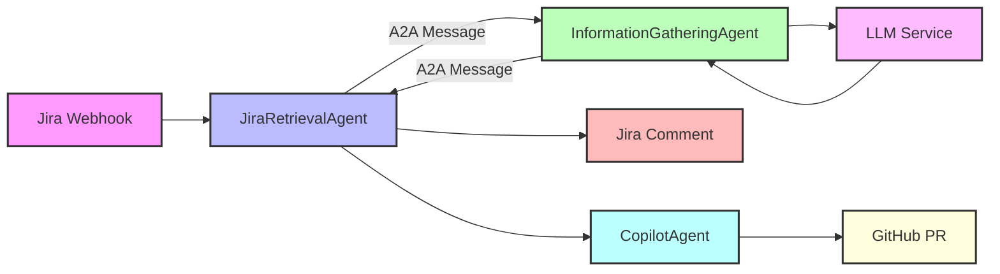

# Jira A2A System Documentation

## Overview

The Jira A2A system implements a DevOps workflow automation platform using the tRPC-A2A-Go framework. It consists of independent Go agents that communicate via A2A messages, each implementing the standard TaskProcessor interface.

The system automates development workflows by:
1. Monitoring Jira tickets through webhooks
2. Analyzing ticket information with AI assistance
3. Generating code implementations for tickets
4. Creating GitHub pull requests with implemented solutions

## System Architecture



### Key Components

1. **JiraRetrievalAgent**: 
   - Handles Jira webhook events
   - Extracts ticket information
   - Coordinates with other agents
   - Posts analysis results back to Jira

2. **InformationGatheringAgent**:
   - Analyzes ticket information
   - Integrates with LLM for intelligent analysis
   - Generates insights and recommendations
   - Returns structured analysis results

3. **CopilotAgent** (Planned):
   - Receives implementation requirements from JiraRetrievalAgent
   - Integrates with GitHub Copilot API
   - Generates code based on ticket requirements
   - Creates pull requests with implementations

4. **LLM Integration**:
   - Provides AI-powered analysis
   - Generates summaries and insights
   - Identifies missing information
   - Recommends next actions

## System Workflow

1. **Webhook Reception**: JiraRetrievalAgent receives a webhook from Jira
2. **Data Extraction**: JiraRetrievalAgent extracts ticket details
3. **Task Creation**: JiraRetrievalAgent creates a "ticket-available" task
4. **Analysis Request**: JiraRetrievalAgent sends the task to InformationGatheringAgent
5. **Information Analysis**: InformationGatheringAgent processes the task with LLM assistance
6. **Results Return**: InformationGatheringAgent returns structured insights to JiraRetrievalAgent
7. **Jira Update**: JiraRetrievalAgent posts a comment to the Jira ticket
8. **Code Implementation**: (Future) JiraRetrievalAgent triggers CopilotAgent for code generation
9. **Pull Request Creation**: (Future) CopilotAgent creates a GitHub pull request

## Current Implementation Status

The system currently implements:

1. **JiraRetrievalAgent**: Fully implemented
   - Webhook handling
   - Jira API integration
   - Task coordination with InformationGatheringAgent

2. **InformationGatheringAgent**: Fully implemented
   - Task processing
   - LLM integration
   - Analysis generation

3. **CopilotAgent**: Planned, not implemented
   - Design and architecture documented
   - Implementation pending

## Component Details

### JiraRetrievalAgent

**Purpose**: Acts as the system's entry point by handling Jira webhooks and coordinating other agents.

**Key Functions**:
- Processes incoming Jira webhook events
- Retrieves comprehensive ticket information from Jira API
- Transforms Jira data into structured tasks
- Sends tasks to the InformationGatheringAgent
- Posts analysis results back to Jira tickets
- Triggers implementation requests (future)

**Webhook Structure**:
```json
{
  "timestamp": 1714824000000,
  "webhookEvent": "jira:issue_created",
  "issue_event_type_name": "issue_created",
  "user": {
    "accountId": "5d1234567890abcdef123456",
    "displayName": "Alice Example"
  },
  "issue": {
    "id": "10002",
    "key": "PROJ-456",
    "fields": {
      "summary": "Cannot log in to the system",
      "description": "User reports being unable to log in with correct credentials.",
      "issuetype": {
        "name": "Bug"
      },
      "priority": {
        "name": "High"
      }
    }
  }
}
```

### InformationGatheringAgent

**Purpose**: Analyzes ticket information to provide structured insights and recommendations.

**Key Functions**:
- Receives "ticket-available" tasks from JiraRetrievalAgent
- Processes ticket data using LLM for intelligent analysis
- Generates structured insights and recommendations
- Returns analysis results to JiraRetrievalAgent
- Maintains detailed task status tracking

**Analysis Process**:
1. Extracts task data from incoming messages
2. Prepares prompt for LLM with ticket information
3. Sends prompt to LLM service for analysis
4. Parses LLM response to extract structured insights
5. Formats results as an "info-gathered" message
6. Returns results to JiraRetrievalAgent

**Example Analysis Results**:
```json
{
  "ticketId": "PROJ-123",
  "analysisResult": {
    "keyThemes": "authentication, login, security",
    "riskLevel": "high",
    "priority": "high",
    "technicalImpact": "Users unable to access the system, potential security issue",
    "businessImpact": "Loss of productivity, customer frustration",
    "suggestedComponents": "auth-service, user-management",
    "missingInformation": "Browser details, error messages, steps to reproduce"
  },
  "summary": "This appears to be a critical login issue affecting users' ability to access the system. It's likely related to the authentication service and should be addressed with high priority."
}
```

### LLM Integration

**Purpose**: Provides AI-powered analysis of ticket information.

**Implementation**:
- Integrates with OpenAI API (or alternative LLM providers)
- Implements prompt engineering for consistent analysis
- Handles API communication, rate limiting, and error handling
- Extracts structured data from LLM responses

**Configuration**:
```
LLM_PROVIDER=openai
LLM_MODEL=gpt-4
LLM_API_KEY=your-api-key
LLM_MAX_TOKENS=4000
LLM_TEMPERATURE=0.0
```

### CopilotAgent (Planned)

**Purpose**: Automates code implementation based on ticket requirements.

**Planned Functions**:
- Receives implementation tasks from JiraRetrievalAgent
- Communicates with GitHub Copilot API
- Generates code based on ticket requirements
- Creates branches and commits changes
- Opens pull requests with implementations
- Links pull requests to original tickets

## Setup and Configuration

### Prerequisites

- Go 1.20 or higher
- Access to Jira and GitHub APIs
- OpenAI API key (or other LLM provider)
- Docker (optional, for containerized deployment)

### Environment Variables

Create a `.env` file with the following configuration:

```
# Server configuration
SERVER_HOST=localhost
SERVER_PORT=8080  # InformationGatheringAgent
SERVER_PORT_JIRA=8081  # JiraRetrievalAgent
SERVER_PORT_COPILOT=8082  # CopilotAgent (future)

# Agent configuration
AGENT_NAME_INFO=InformationGatheringAgent
AGENT_NAME_JIRA=JiraRetrievalAgent
AGENT_NAME_COPILOT=CopilotAgent
AGENT_VERSION=1.0.0
AGENT_URL_INFO=http://localhost:8080
AGENT_URL_JIRA=http://localhost:8081
AGENT_URL_COPILOT=http://localhost:8082

# Jira configuration
JIRA_BASE_URL=https://your-jira-instance.atlassian.net
JIRA_USERNAME=your-jira-username
JIRA_API_TOKEN=your-jira-api-token

# GitHub configuration (for future CopilotAgent)
GITHUB_TOKEN=your-github-personal-access-token

# LLM configuration
LLM_ENABLED=true
LLM_PROVIDER=openai
LLM_MODEL=gpt-4
LLM_API_KEY=your-openai-api-key
LLM_MAX_TOKENS=4000
LLM_TEMPERATURE=0.0

# Authentication
AUTH_TYPE=apikey
API_KEY=your-api-key
```

### Running the Application

#### Using Make

```bash
# Start all agents
make run-all

# Start specific agents
make run-info
make run-jira

# View logs
make logs-all
make logs-info
make logs-jira

# Stop all agents
make stop-all
```

#### Using Docker Compose

```bash
docker-compose up -d
```

#### Manually

```bash
# Start InformationGatheringAgent
cd cmd/infogathering
go build
./infogathering

# Start JiraRetrievalAgent
cd cmd/jiraretrieval
go build
./jiraretrieval
```

## Testing

### Simulating a Jira Webhook

Test the system by sending a simulated webhook to the JiraRetrievalAgent:

```bash
curl -X POST http://localhost:8081/webhook \
  -H "Content-Type: application/json" \
  -d '{
    "ticketId": "TEST-123",
    "event": "created"
  }'
```

### Direct Task Testing

Test the InformationGatheringAgent directly:

```bash
cd cmd/infogathering
./infogathering client
```

This will send a test task to the InformationGatheringAgent and display the results.

## Known Limitations and Future Improvements

### Current Limitations

1. **Tight Coupling**: Components are tightly coupled with limited use of interfaces.
   - Impact: Code changes in one component often affect others
   - Improvement: Implement interface-based design for better modularity

2. **Error Handling**: Limited context in error messages makes debugging difficult.
   - Impact: Troubleshooting issues can be challenging
   - Improvement: Enhance error context and implement structured logging

3. **Testing Coverage**: Insufficient unit and integration tests.
   - Impact: Harder to verify functionality and prevent regressions
   - Improvement: Add comprehensive test suite and CI pipeline

4. **Configuration Management**: Limited validation of configuration settings.
   - Impact: Improper configuration may not be detected until runtime
   - Improvement: Implement comprehensive config validation

5. **Documentation**: Documentation may not fully reflect current implementation.
   - Impact: Developers may struggle to understand the system
   - Improvement: Keep documentation in sync with code changes

6. **Security**: Basic authentication mechanisms without robust security practices.
   - Impact: Potential security vulnerabilities
   - Improvement: Implement proper security measures including mTLS, JWT with rotation, etc.

7. **Performance**: No performance optimization or rate limiting.
   - Impact: May experience issues with high load
   - Improvement: Add rate limiting, caching, and performance monitoring

### Future Improvements

1. **CopilotAgent Implementation**: Complete the CopilotAgent for automated code generation.

2. **Enhanced Security**: Implement mTLS and more robust authentication.

3. **Improved Observability**: Add comprehensive logging, metrics, and tracing.

4. **Scalability Enhancements**: Optimize for handling larger volumes of tickets.

5. **UI Dashboard**: Create a web interface for monitoring and managing the system.

6. **Expanded LLM Capabilities**: Enhance LLM integration with fine-tuned models.

7. **Multi-Project Support**: Support multiple Jira projects with different configurations.

## Support and Contribution

### Getting Help

For issues or questions:
1. Check the documentation and known limitations
2. Review logs for error messages
3. Create an issue in the repository

### Contributing

To contribute to the project:
1. Fork the repository
2. Create a feature branch
3. Make your changes
4. Write tests for your changes
5. Submit a pull request

## License

[MIT License]