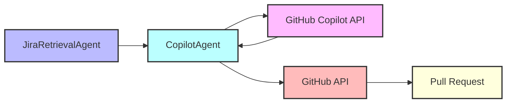

# GitHub Copilot Integration: Current Status and Limitations

## Current Implementation Status

The Jira A2A system currently has design plans for GitHub Copilot integration through the CopilotAgent, but this component has not yet been implemented. The existing documentation outlines how this integration would work, but the actual code implementation is pending.

## Planned Architecture



## Key Components in Design

1. **CopilotAgent**: 
   - Planned as a TaskProcessor that receives "implement-code" tasks from JiraRetrievalAgent
   - Would integrate with GitHub Copilot API to generate code
   - Would create GitHub pull requests with implementations

2. **GitHub Copilot Integration**:
   - Would be implemented through GitHub's Copilot API
   - Requires GitHub App configuration
   - Planned to use SSE (Server-Sent Events) for communication

3. **GitHub API Integration**:
   - Would create branches, commits, and pull requests
   - Links pull requests to original Jira tickets

## Major Limitations and Challenges

1. **Missing Implementation**: The CopilotAgent exists only in documentation, not in code.
   - Impact: The automated code generation workflow is not functional
   - Resolution: Implement the CopilotAgent as specified in the documentation

2. **Evolving GitHub Copilot API**: The GitHub Copilot API is still evolving and may change.
   - Impact: Implementation details might need to adapt to API changes
   - Resolution: Maintain flexibility in the integration design

3. **Authentication Complexity**: GitHub Copilot requires complex authentication setup.
   - Impact: Additional security and authentication configuration needed
   - Resolution: Implement robust GitHub App authentication

4. **Integration Testing Challenges**: Testing with actual Copilot API requires paid access.
   - Impact: Difficult to test without incurring costs
   - Resolution: Create mock interfaces for testing

5. **Prompt Engineering Complexity**: Creating effective prompts for code generation is challenging.
   - Impact: Generated code quality depends heavily on prompt quality
   - Resolution: Develop and refine prompt templates

6. **Rate Limiting Concerns**: GitHub API and Copilot API have rate limits.
   - Impact: High volume usage might hit limits
   - Resolution: Implement queuing and rate limit handling

7. **Code Review Integration**: Generated code requires human review.
   - Impact: Fully automated workflow not possible
   - Resolution: Design for human-in-the-loop review process

## Implementation Requirements

To implement the CopilotAgent as designed, the following components need to be created:

1. **CopilotAgent Structure**:
   ```go
   type CopilotAgent struct {
       config       *config.Config
       githubClient *github.Client
       copilotClient *copilot.Client
   }
   ```

2. **Copilot Client**:
   ```go
   type Client struct {
       apiKey        string
       integrationID string
       httpClient    *http.Client
   }
   ```

3. **SSE Endpoint**:
   ```go
   func sseHandler(w http.ResponseWriter, r *http.Request) {
       // Handle SSE connection with GitHub Copilot
   }
   ```

4. **Pull Request Creation**:
   ```go
   func (a *CopilotAgent) createPullRequest(ctx context.Context, task *models.ImplementCodeTask, code string) error {
       // Create branch, commit code, and open PR
   }
   ```

## Next Steps for Implementation

1. **Create Basic Structure**: 
   - Implement the CopilotAgent struct and its initialization
   - Create GitHub and Copilot client wrappers

2. **Implement Core Functions**:
   - Create prompt generation for code requests
   - Implement code extraction from responses
   - Set up branch creation and PR functionality

3. **Set Up Authentication**:
   - Configure GitHub App for Copilot integration
   - Implement OAuth flow for GitHub API access

4. **Add SSE Endpoint**:
   - Create the SSE handler for Copilot communication
   - Implement proper event handling

5. **Integrate with JiraRetrievalAgent**:
   - Update JiraRetrievalAgent to trigger the CopilotAgent
   - Define the task data interface between agents

6. **Testing**:
   - Create unit tests with mocked responses
   - Implement integration tests for GitHub API interactions
   - Test end-to-end workflow with sample tickets

## Conclusion

The GitHub Copilot integration is a promising feature that would add significant automation capabilities to the Jira A2A workflow. While the design is well-documented, the actual implementation is still pending. By addressing the identified limitations and following the implementation plan, the development team can successfully add this feature to the existing system.