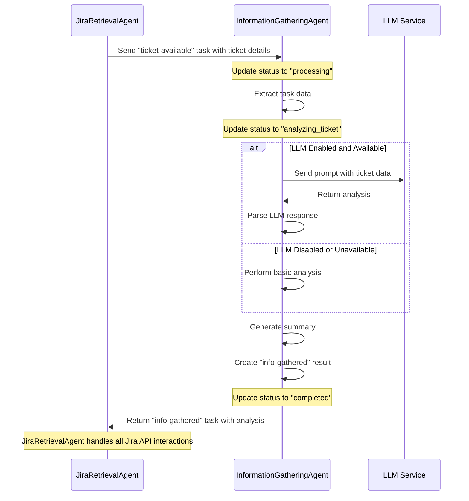

# InformationGatheringAgent Implementation Guide

## Overview

The InformationGatheringAgent is a key component of the Jira A2A system, responsible for analyzing Jira ticket information and providing intelligent insights. This document outlines the implementation details for the InformationGatheringAgent with LLM integration via langchain-go.

## Core Responsibilities

1. Receive ticket information from JiraRetrievalAgent (including all necessary ticket details)
2. Analyze the ticket details using the LLM or fallback to basic analysis
3. Generate structured insights and recommendations
4. Return analysis results to JiraRetrievalAgent for further processing

## Architecture

The InformationGatheringAgent implements the TaskProcessor interface from the trpc-a2a-go framework. It connects to LLM services via langchain-go, providing intelligent analysis of ticket information.

The agent is designed as a pure information summarizer without any direct Jira API interactions. All Jira API interactions are handled by the JiraRetrievalAgent. This clean separation of responsibilities makes the system more modular and easier to maintain.

The agent includes fallback mechanisms for when LLM services are unavailable or disabled, ensuring continuous operation even in degraded states.

### Workflow Sequence



This sequence diagram illustrates the simplified workflow of the InformationGatheringAgent as a pure information summarizer. It receives ticket details from the JiraRetrievalAgent, performs analysis (with or without LLM), and returns the results. All Jira API interactions are handled by the JiraRetrievalAgent, not the InformationGatheringAgent.

## Implementation Details

### 1. Agent Structure

The InformationGatheringAgent is structured as follows:

```go
type InformationGatheringAgent struct {
	config    *config.Config
	llmClient llm.LLMClient
	// No Jira client as this agent doesn't interact with Jira API
}
```

- `config`: Contains configuration settings for the agent and LLM
- `llmClient`: Client for interacting with the LLM service via langchain-go

### 2. Initialization

```go
func NewInformationGatheringAgent(cfg *config.Config) *InformationGatheringAgent {
	var llmClient llm.LLMClient
	
	// Initialize LLM client if enabled
	if cfg.LLMEnabled {
		var err error
		llmClient, err = llm.NewClient(cfg)
		if err != nil {
			log.Printf("Warning: Failed to initialize LLM client: %v", err)
			log.Printf("Falling back to basic analysis without LLM")
		}
	} else {
		log.Printf("LLM is disabled in config, using basic analysis")
	}
	
	// Note: No Jira client initialization as this agent doesn't interact with Jira API
	return &InformationGatheringAgent{
		config:    cfg,
		llmClient: llmClient,
	}
}
```

The initialization function sets up the agent with the provided configuration. It conditionally initializes the LLM client if enabled, with appropriate fallback mechanisms if initialization fails.

### 3. Task Processing Flow

The main entry point is the `Process` method implementing the TaskProcessor interface:

```go
func (a *InformationGatheringAgent) Process(ctx context.Context, taskID string, message protocol.Message, handle taskmanager.TaskHandle) error {
	// Log the incoming message for debugging
	log.Printf("Received task with ID: %s", taskID)
	
	// Update status to processing
	if err := handle.UpdateStatus(protocol.TaskState("processing"), nil); err != nil {
		return fmt.Errorf("failed to update status: %w", err)
	}
	
	// Extract the task data from message
	// This should include all necessary ticket details provided by JiraRetrievalAgent
	var task models.TicketAvailableTask
	if err := a.extractTaskData(message, &task); err != nil {
		return fmt.Errorf("failed to extract task data: %w", err)
	}
	
	// Update status to analyzing ticket
	if err := handle.UpdateStatus(protocol.TaskState("analyzing_ticket"), nil); err != nil {
		return fmt.Errorf("failed to update status: %w", err)
	}
	
	// Analyze the ticket information
	analysis := a.analyzeTicketInfo(&task)
	
	// Generate a summary
	summary := a.generateSummary(&task, analysis)
	
	// Record the analysis result as an artifact
	artifact := protocol.Artifact{
		Name:        stringPtr("analysis"),
		Description: stringPtr("Ticket Analysis"),
		Parts:       []protocol.Part{protocol.NewTextPart(summary)},
		Metadata: map[string]interface{}{
			"ticketId": task.TicketID,
		},
	}
	if err := handle.AddArtifact(artifact); err != nil {
		return fmt.Errorf("failed to record artifact: %w", err)
	}
	
	// Create the info-gathered result with extended fields
	infoGatheredTask := models.InfoGatheredTask{
		TicketID: task.TicketID,
		CollectedFields: map[string]string{
			"Summary":           task.Summary,
			"Analysis":          "Completed",
			"Suggestion":        analysis.Suggestion,
			"RiskLevel":         analysis.RiskLevel,
			"Priority":          analysis.Priority,
			"KeyThemes":         strings.Join(analysis.KeyThemes, ", "),
			"Requirements":      strings.Join(analysis.Requirements, ", "),
			"LLMGenerated":      fmt.Sprintf("%v", analysis.LLMUsed),
			"TechnicalAnalysis": analysis.TechnicalAnalysis,
			"BusinessImpact":    analysis.BusinessImpact,
			"NextSteps":         analysis.NextSteps,
		},
	}
	
	// Add recommended fields if available
	if analysis.RecommendedPriority != "" {
		infoGatheredTask.CollectedFields["RecommendedPriority"] = analysis.RecommendedPriority
	}
	
	if len(analysis.RecommendedComponents) > 0 {
		infoGatheredTask.CollectedFields["RecommendedComponents"] = strings.Join(analysis.RecommendedComponents, ", ")
	}
	
	if len(analysis.RecommendedLabels) > 0 {
		infoGatheredTask.CollectedFields["RecommendedLabels"] = strings.Join(analysis.RecommendedLabels, ", ")
	}
	
	// Create the response message
	resultJSON, err := json.Marshal(infoGatheredTask)
	if err != nil {
		return fmt.Errorf("failed to marshal info-gathered task: %w", err)
	}
	
	responseMsg := &protocol.Message{
		Parts: []protocol.Part{protocol.NewTextPart(string(resultJSON))},
	}
	
	// Complete the task with the response
	if err := handle.UpdateStatus(protocol.TaskState("completed"), responseMsg); err != nil {
		return fmt.Errorf("failed to complete task: %w", err)
	}
	
	log.Printf("Task %s completed successfully", taskID)
	return nil
}
```

The process method handles the entire task lifecycle from receiving the task to returning the analysis. It maintains status updates throughout the process for better observability.

### 4. Extracting Task Data

```go
func (a *InformationGatheringAgent) extractTaskData(message protocol.Message, task *models.TicketAvailableTask) error {
	// Handle case when message has parts
	if len(message.Parts) > 0 {
		// Try to extract text parts
		for _, part := range message.Parts {
			if textPart, ok := part.(*protocol.TextPart); ok && textPart != nil {
				// Try direct unmarshal
				if err := json.Unmarshal([]byte(textPart.Text), task); err == nil {
					// Validate required fields
					if task.TicketID != "" && task.Summary != "" {
						return nil
					}
				}
			}
		}
		
		// Try other parsing approaches if direct method fails
		// ...
	}
	
	return fmt.Errorf("no valid ticket-available task data found in message")
}
```

This function extracts the task data from the message parts, handling various formats and providing robust error handling.

### 5. Analysis Result Structure

```go
type AnalysisResult struct {
	KeyThemes            []string
	RiskLevel            string
	Priority             string
	Suggestion           string
	Requirements         []string
	LLMUsed              bool
	Confidence           float64
	TechnicalAnalysis    string
	BusinessImpact       string
	NextSteps            string
	RecommendedPriority  string
	RecommendedComponents []string
	RecommendedLabels    []string
}
```

The AnalysisResult structure contains the complete analysis output, including both the basic analysis fields and extended fields for more comprehensive insights.

### 6. LLM Integration for Analysis

The analysis logic is split into two paths:

```go
func (a *InformationGatheringAgent) analyzeTicketInfo(task *models.TicketAvailableTask) *AnalysisResult {
	// Try LLM analysis first if available
	if a.llmClient != nil {
		llmResult, err := a.analyzeWithLLM(task)
		if err == nil {
			log.Printf("Successfully analyzed ticket with LLM")
			return llmResult
		}
		
		log.Printf("LLM analysis failed: %v, falling back to basic analysis", err)
	}
	
	// Fallback to basic analysis
	return a.performBasicAnalysis(task)
}
```

#### LLM Analysis

```go
func (a *InformationGatheringAgent) analyzeWithLLM(task *models.TicketAvailableTask) (*AnalysisResult, error) {
	// Create a prompt for the LLM
	prompt := a.createLLMPrompt(task)
	
	// Call the LLM for completion
	response, err := a.llmClient.Complete(context.Background(), prompt)
	if err != nil {
		return nil, fmt.Errorf("LLM completion failed: %w", err)
	}
	
	// Parse the LLM response
	result, err := a.parseLLMResponse(response)
	if err != nil {
		return nil, fmt.Errorf("failed to parse LLM response: %w", err)
	}
	
	// Mark as LLM-generated
	result.LLMUsed = true
	
	return result, nil
}
```

The LLM analysis process involves:

1. **Creating a Prompt**: Generating a structured prompt with ticket information
2. **Calling the LLM**: Sending the prompt to the LLM via langchain-go
3. **Parsing the Response**: Converting the LLM's response into a structured AnalysisResult

```go
func (a *InformationGatheringAgent) createLLMPrompt(task *models.TicketAvailableTask) string {
	// Build a structured prompt with ticket details
	// Include instructions for JSON response format
	// ...
}

func (a *InformationGatheringAgent) parseLLMResponse(response string) (*AnalysisResult, error) {
	// Extract JSON from response
	// Parse into structured fields
	// Handle potential parsing errors
	// ...
}
```

Helper functions for handling LLM responses:

```go
func extractJSON(text string) (string, error) {
	// Find JSON in text and validate
	// ...
}

func normalizeRiskLevel(level string) string {
	// Normalize different risk level terms to standard values
	// ...
}

func normalizePriority(priority string) string {
	// Normalize different priority terms to standard values
	// ...
}
```

### 7. Fallback Basic Analysis

```go
func (a *InformationGatheringAgent) performBasicAnalysis(task *models.TicketAvailableTask) *AnalysisResult {
	// Implement keyword matching for themes
	// Determine risk level and priority based on metadata
	// Generate appropriate suggestions
	// ...
}
```

The basic analysis provides a simpler but still useful analysis when LLM is unavailable, ensuring the system remains functional in all situations.

### 8. Summary Generation

```go
func (a *InformationGatheringAgent) generateSummary(task *models.TicketAvailableTask, analysis *AnalysisResult) string {
	// Create a formatted summary with key findings
	// Include all relevant sections based on available data
	// Add appropriate footer based on analysis method
	// ...
}
```

This function generates a well-formatted summary of the analysis results in a format suitable for posting as a Jira comment.

### 9. Helper Functions

```go
func contains(slice []string, item string) bool {
	return slices.Contains(slice, item)
}

func capitalize(s string) string {
	if s == "" {
		return ""
	}
	return strings.ToUpper(s[:1]) + s[1:]
}

func stringPtr(s string) *string {
	return &s
}
```

These helper functions provide common utilities needed throughout the implementation.

## LLM Integration Details

### 1. LLM Client

The LLM integration is implemented via a dedicated package:

```go
package llm

import (
	"context"
	"time"
	"github.com/tmc/langchaingo/llms"
	"github.com/tmc/langchaingo/llms/openai"
)

// LLMClient defines the interface for interacting with LLM services
type LLMClient interface {
	Complete(ctx context.Context, prompt string) (string, error)
}

// Client implements the LLMClient interface using langchain-go
type Client struct {
	llm       llms.LLM
	maxTokens int
	timeout   time.Duration
}
```

The LLM client provides a clean abstraction over langchain-go:

```go
func NewClient(cfg *config.Config) (LLMClient, error) {
	var llmModel llms.LLM
	var err error

	// Select LLM provider based on configuration
	switch cfg.LLMProvider {
	case "openai":
		llmModel, err = openai.New(
			openai.WithToken(cfg.LLMAPIKey),
			openai.WithModel(cfg.LLMModel),
		)
	case "azure":
		llmModel, err = openai.New(
			openai.WithToken(cfg.LLMAPIKey),
			openai.WithModel(cfg.LLMModel),
			openai.WithBaseURL(cfg.LLMServiceURL),
		)
	default:
		return nil, fmt.Errorf("unsupported LLM provider: %s", cfg.LLMProvider)
	}

	// ...

	return &Client{
		llm:       llmModel,
		maxTokens: cfg.LLMMaxTokens,
		timeout:   time.Duration(cfg.LLMTimeout) * time.Second,
	}, nil
}

func (c *Client) Complete(ctx context.Context, prompt string) (string, error) {
	// Create a context with timeout
	timeoutCtx, cancel := context.WithTimeout(ctx, c.timeout)
	defer cancel()

	// Call the LLM for completion via langchain-go
	completion, err := c.llm.Call(timeoutCtx, prompt, llms.WithMaxTokens(c.maxTokens))
	if err != nil {
		return "", fmt.Errorf("LLM call failed: %w", err)
	}

	return completion, nil
}
```

### 2. LLM Configuration

LLM configuration is managed via the config package:

```go
type Config struct {
	// ... existing fields
	
	// LLM configuration
	LLMEnabled     bool
	LLMProvider    string // "openai", "azure", "anthropic"
	LLMModel       string
	LLMAPIKey      string
	LLMServiceURL  string
	LLMMaxTokens   int
	LLMTimeout     int // in seconds
	LLMTemperature float64
}
```

Configuration is loaded from environment variables:

```
# LLM configuration
LLM_ENABLED=true          # Set to true to enable LLM integration
LLM_PROVIDER=openai       # openai or azure
LLM_MODEL=gpt-4           # Or other model name
LLM_API_KEY=your-api-key
LLM_SERVICE_URL=          # Only needed for Azure OpenAI
LLM_MAX_TOKENS=4000
LLM_TIMEOUT=30            # Timeout in seconds
LLM_TEMPERATURE=0.0       # Lower values make output more deterministic
```

## Example Workflow

### 1. Receiving a Task

The agent receives a task with the following data:

```json
{
  "ticketId": "PROJ-123",
  "summary": "System crashes when processing large files",
  "metadata": {
    "priority": "high",
    "reporter": "Alice Johnson",
    "event": "created",
    "issueType": "bug",
    "components": "file-processor"
  }
}
```

### 2. Sending to LLM

The agent creates a prompt for the LLM:

```
You are an expert in analyzing Jira tickets and providing insights. 
Please analyze the following Jira ticket information:

Ticket ID: PROJ-123
Summary: System crashes when processing large files
Priority: high
Reporter: Alice Johnson
Issue Type: bug
Components: file-processor

Please provide a comprehensive analysis in JSON format with the following fields:
{
  "keyThemes": ["theme1", "theme2", ...],
  "riskLevel": "high|medium|low",
  "priority": "high|medium|low",
  "suggestion": "Your main suggestion for handling this ticket",
  "requirements": ["requirement1", "requirement2", ...],
  "technicalAnalysis": "Detailed technical analysis of the issue",
  "businessImpact": "Impact on business operations",
  "nextSteps": "Recommended next steps for handling this ticket",
  "recommendedPriority": "high|medium|low",
  "recommendedComponents": ["component1", "component2", ...],
  "recommendedLabels": ["label1", "label2", ...]
}

Ensure your analysis is concise but comprehensive, covering both technical and business aspects.
```

### 3. LLM Response

The LLM returns a structured response:

```json
{
  "keyThemes": ["crash", "performance", "file processing", "stability"],
  "riskLevel": "high",
  "priority": "high",
  "suggestion": "This issue requires immediate attention as it impacts core functionality. Investigate memory management in the file-processor component.",
  "requirements": [
    "Reproduce the crash with large files",
    "Analyze memory usage during file processing",
    "Check for memory leaks",
    "Review error handling in file-processor component",
    "Implement proper resource cleanup"
  ],
  "technicalAnalysis": "The system crash suggests a potential memory management issue or resource exhaustion when handling large files. This could be due to inefficient streaming, buffer overflows, or lack of proper resource cleanup.",
  "businessImpact": "This issue affects users working with large files, potentially causing data loss and workflow disruptions. It may also lead to user frustration and decreased trust in the system.",
  "nextSteps": "Assign to a senior developer familiar with the file-processor component. Set up monitoring to track memory usage during file processing. Prioritize this fix in the current sprint.",
  "recommendedPriority": "high",
  "recommendedComponents": ["file-processor", "memory-management", "error-handling"],
  "recommendedLabels": ["crash", "performance", "bug", "memory"]
}
```

### 4. Generated Summary

The agent formats the analysis into a readable summary:

```
*Information Gathering Summary*

I've analyzed ticket PROJ-123: "System crashes when processing large files" and gathered the following information:

*Key Themes:*
- Crash
- Performance
- File processing
- Stability

*Risk Assessment:* High
*Priority:* High

*Technical Analysis:*
The system crash suggests a potential memory management issue or resource exhaustion when handling large files. This could be due to inefficient streaming, buffer overflows, or lack of proper resource cleanup.

*Business Impact:*
This issue affects users working with large files, potentially causing data loss and workflow disruptions. It may also lead to user frustration and decreased trust in the system.

*Requirements:*
- Reproduce the crash with large files
- Analyze memory usage during file processing
- Check for memory leaks
- Review error handling in file-processor component
- Implement proper resource cleanup

*Recommended Components:*
- file-processor
- memory-management
- error-handling

*Recommended Labels:*
- crash
- performance
- bug
- memory

*Next Steps:*
Assign to a senior developer familiar with the file-processor component. Set up monitoring to track memory usage during file processing. Prioritize this fix in the current sprint.

*Suggestion:* This issue requires immediate attention as it impacts core functionality. Investigate memory management in the file-processor component.

_This analysis was generated with AI assistance._
```

### 5. Response to JiraRetrievalAgent

The agent sends the analysis back to the JiraRetrievalAgent:

```json
{
  "ticketId": "PROJ-123",
  "collectedFields": {
    "Summary": "System crashes when processing large files",
    "Analysis": "Completed",
    "Suggestion": "This issue requires immediate attention as it impacts core functionality. Investigate memory management in the file-processor component.",
    "RiskLevel": "high",
    "Priority": "high",
    "KeyThemes": "crash, performance, file processing, stability",
    "Requirements": "Reproduce the crash with large files, Analyze memory usage during file processing, Check for memory leaks, Review error handling in file-processor component, Implement proper resource cleanup",
    "LLMGenerated": "true",
    "TechnicalAnalysis": "The system crash suggests a potential memory management issue or resource exhaustion when handling large files. This could be due to inefficient streaming, buffer overflows, or lack of proper resource cleanup.",
    "BusinessImpact": "This issue affects users working with large files, potentially causing data loss and workflow disruptions. It may also lead to user frustration and decreased trust in the system.",
    "NextSteps": "Assign to a senior developer familiar with the file-processor component. Set up monitoring to track memory usage during file processing. Prioritize this fix in the current sprint.",
    "RecommendedPriority": "high",
    "RecommendedComponents": "file-processor, memory-management, error-handling",
    "RecommendedLabels": "crash, performance, bug, memory"
  }
}
```

## Testing the InformationGatheringAgent

### 1. Unit Testing

Unit tests should be created for each component, particularly focusing on:

- Prompt creation
- Response parsing
- Fallback analysis logic

Example test for LLM analysis:

```go
func TestAnalyzeWithLLM(t *testing.T) {
	// Create a mock LLM client
	mockClient := &mockLLMClient{
		response: `{"keyThemes":["test"],"riskLevel":"high","priority":"high","suggestion":"Test suggestion"}`,
	}
	
	// Create agent with mock client
	agent := &InformationGatheringAgent{
		config:    &config.Config{},
		llmClient: mockClient,
	}
	
	// Create a test task
	task := &models.TicketAvailableTask{
		TicketID: "TEST-123",
		Summary:  "Test ticket",
	}
	
	// Call the function
	result, err := agent.analyzeWithLLM(task)
	
	// Assertions
	require.NoError(t, err)
	require.NotNil(t, result)
	assert.True(t, result.LLMUsed)
	assert.Equal(t, "high", result.RiskLevel)
	assert.Equal(t, "Test suggestion", result.Suggestion)
}

// Mock LLM client for testing
type mockLLMClient struct {
	response string
	err      error
}

func (m *mockLLMClient) Complete(ctx context.Context, prompt string) (string, error) {
	if m.err != nil {
		return "", m.err
	}
	return m.response, nil
}
```

### 2. Integration Testing

Integration tests should verify the full process flow with actual LLM calls, controlled via environment variables:

```go
func TestIntegrationWithLLM(t *testing.T) {
	// Skip if LLM integration tests are not enabled
	if os.Getenv("ENABLE_LLM_TESTS") != "true" {
		t.Skip("Skipping LLM integration test. Set ENABLE_LLM_TESTS=true to run")
	}
	
	// Create real config and agent
	cfg := config.NewConfig()
	agent := NewInformationGatheringAgent(cfg)
	
	// Test with a real ticket
	// ...
}
```

### 3. Manual Testing with cURL

You can test the agent manually using cURL:

```bash
curl -X POST \
  -H "Content-Type: application/json" \
  -H "X-API-Key: your-api-key" \
  -d '{
    "parts": [
      {
        "type": "text",
        "text": "{\"ticketId\":\"TEST-123\",\"summary\":\"System crashes when processing large files\",\"metadata\":{\"priority\":\"high\"}}"
      }
    ]
  }' \
  http://localhost:8080/tasks
```

## Configuration Options

Key configuration options for the InformationGatheringAgent:

```
# Server configuration
SERVER_PORT=8080
SERVER_HOST=localhost

# Agent configuration
AGENT_NAME=InformationGatheringAgent
AGENT_VERSION=1.0.0
AGENT_URL=http://localhost:8080

# Authentication
AUTH_TYPE=apikey
API_KEY=your-api-key

# LLM configuration
LLM_ENABLED=true           # Enable/disable LLM integration
LLM_PROVIDER=openai        # LLM provider (openai, azure)
LLM_MODEL=gpt-4            # Model to use
LLM_API_KEY=your-api-key   # API key for the LLM service
LLM_MAX_TOKENS=4000        # Maximum tokens for response
LLM_TIMEOUT=30             # Timeout in seconds
LLM_TEMPERATURE=0.0        # Lower values = more deterministic responses
```

## LLM Provider Options

### 1. OpenAI

Configuration for OpenAI:

```go
// OpenAI configuration
llmModel, err = openai.New(
    openai.WithToken(cfg.LLMAPIKey),
    openai.WithModel(cfg.LLMModel),
)
```

Environment variables:
```
LLM_PROVIDER=openai
LLM_MODEL=gpt-4  # or gpt-3.5-turbo
LLM_API_KEY=your-openai-api-key
```

### 2. Azure OpenAI

Configuration for Azure OpenAI:

```go
// Azure OpenAI configuration
llmModel, err = openai.New(
    openai.WithToken(cfg.LLMAPIKey),
    openai.WithModel(cfg.LLMModel),
    openai.WithBaseURL(cfg.LLMServiceURL),
    openai.WithAzure(),
)
```

Environment variables:
```
LLM_PROVIDER=azure
LLM_MODEL=your-deployment-name
LLM_API_KEY=your-azure-api-key
LLM_SERVICE_URL=https://your-resource.openai.azure.com
```

## Best Practices

1. **Error Handling**
   - Implement robust error handling for LLM failures
   - Always provide a fallback mechanism for when LLM is unavailable
   - Log detailed error information for debugging

2. **Performance**
   - Use appropriate timeouts to prevent request hanging
   - Consider caching similar analysis results
   - Implement batching for multiple analyses when possible

3. **Security**
   - Never log complete prompts or responses (they may contain sensitive data)
   - Store API keys securely
   - Implement rate limiting to prevent abuse

4. **Maintainability**
   - Keep prompt templates separate and manageable
   - Document the expected response format clearly
   - Use meaningful variable names that relate to domain concepts

5. **Testing**
   - Create comprehensive unit tests with mock responses
   - Implement integration tests for end-to-end verification
   - Test both happy path and failure scenarios

## Extension Points

The InformationGatheringAgent can be extended in several ways:

1. **Additional LLM Providers**
   - Add support for more providers like Anthropic Claude, Cohere, etc.
   - Update the `NewClient` function to handle different provider configurations

2. **Enhanced Analysis**
   - Add more fields to the AnalysisResult struct
   - Implement domain-specific analysis for different types of tickets
   - Add historical data analysis by comparing with similar tickets

3. **Improved Prompt Engineering**
   - Refine prompts for better responses
   - Implement few-shot learning examples in prompts
   - Create domain-specific templates for different ticket types

4. **Learning Capabilities**
   - Implement feedback mechanisms to improve future analyses
   - Track the quality of responses and adjust prompts accordingly
   - Implement fine-tuning for specific organizational needs

## Conclusion

The InformationGatheringAgent with langchain-go integration provides intelligent analysis of Jira tickets using LLM technology. The implementation follows a robust design with fallback mechanisms, comprehensive error handling, and flexible configuration options.

By leveraging the power of LLMs through langchain-go, the agent can provide deep insights into tickets, saving time for developers and ensuring important aspects are not overlooked.