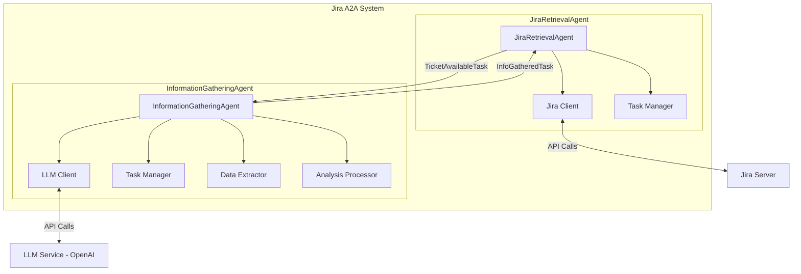
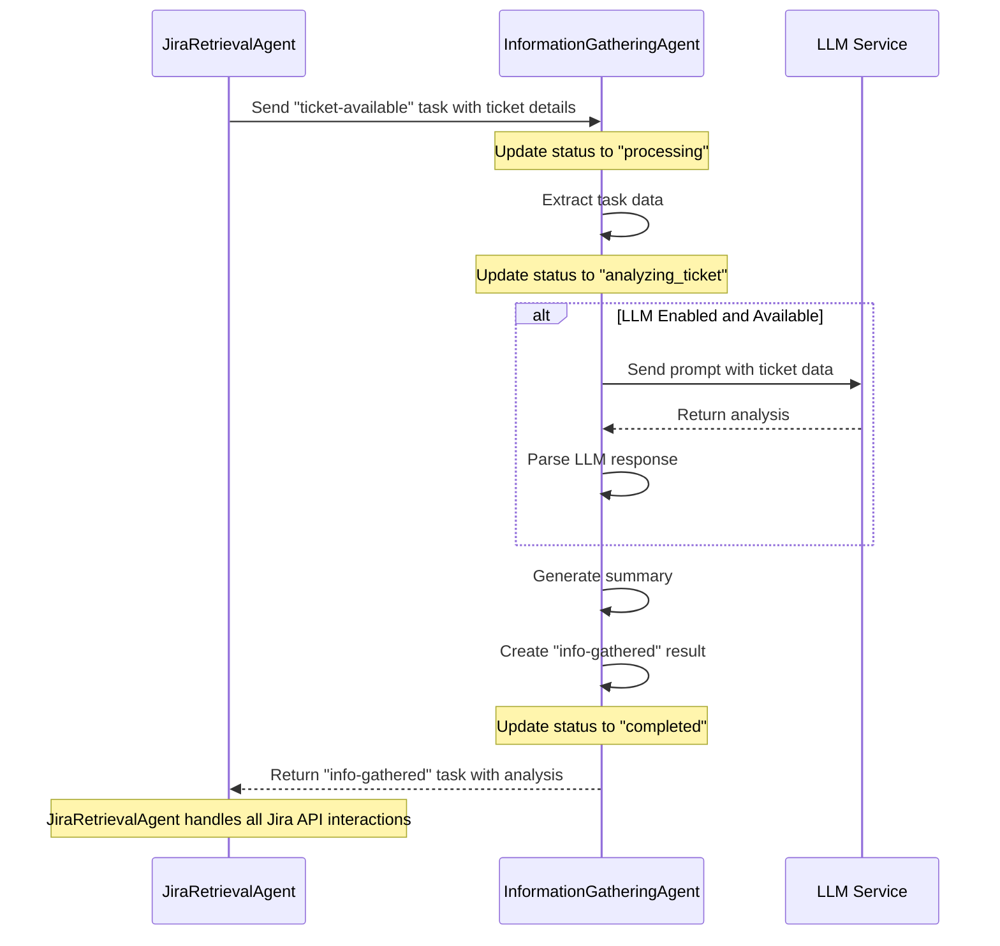
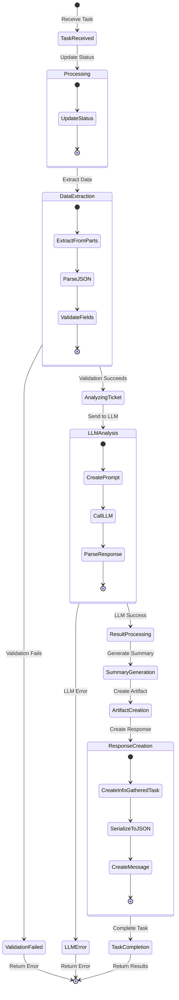
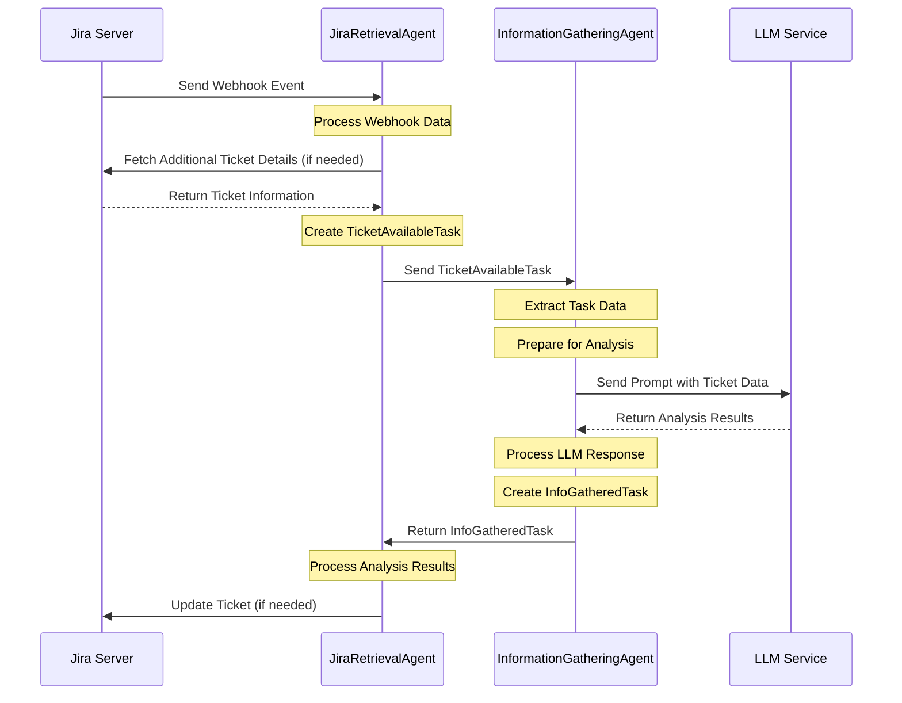
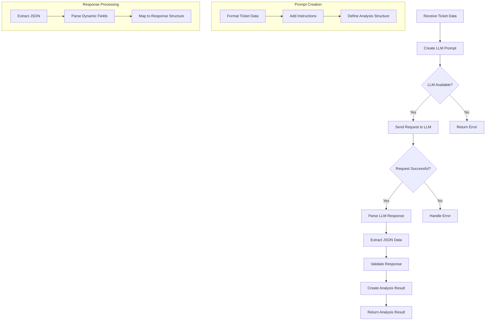

# InformationGatheringAgent Implementation Guide

## Overview

The InformationGatheringAgent is a key component of the Jira A2A system, responsible for analyzing Jira ticket information and providing intelligent insights. This document outlines the implementation details for the InformationGatheringAgent with LLM integration via langchain-go.

## Core Responsibilities

1. Receive ticket information from JiraRetrievalAgent (including all necessary ticket details)
2. Analyze the ticket details using the LLM
3. Generate structured insights and recommendations
4. Return analysis results to JiraRetrievalAgent for further processing

## Configuration

The InformationGatheringAgent is configured through the central Viper-based configuration system. The configuration is loaded from environment variables, a `.env` file, and command-line flags.

### Key Configuration Parameters

- **Basic Settings**:
  - `agent_name`: Set to "InformationGatheringAgent"
  - `server_host`: Host to bind the server to (default: "localhost")
  - `server_port`: Port for the agent's server (default: 8081 for InformationGatheringAgent)

- **LLM Integration**:
  - `llm_enabled`: Whether to use LLM for analysis (boolean)
  - `llm_provider`: The LLM provider to use ("openai")
  - `llm_model`: The model to use (e.g., "gpt-4")
  - `llm_api_key`: API key for the LLM provider (can also be set via `OPENAI_API_KEY`)
  - `llm_max_tokens`: Maximum tokens for LLM responses
  - `llm_temperature`: Temperature setting for LLM responses
  - `llm_timeout`: Timeout in seconds for LLM requests

- **Authentication**:
  - `auth_type`: Authentication type ("jwt" or "apikey")
  - `jwt_secret`: Secret for JWT authentication
  - `api_key`: API key for authentication

## Architecture

The InformationGatheringAgent implements the TaskProcessor interface from the trpc-a2a-go framework. It connects to LLM services via langchain-go, providing intelligent analysis of ticket information.

The agent is designed as a pure information summarizer without any direct Jira API interactions. All Jira API interactions are handled by the JiraRetrievalAgent. This clean separation of responsibilities makes the system more modular and easier to maintain.

### Component Architecture



This architecture diagram illustrates the key components of the InformationGatheringAgent and its relationship with the JiraRetrievalAgent. The InformationGatheringAgent has no direct connection to the Jira Server, relying entirely on the JiraRetrievalAgent for ticket information.

### Workflow Sequence



This sequence diagram illustrates the simplified workflow of the InformationGatheringAgent as a pure information summarizer. It receives ticket details from the JiraRetrievalAgent, performs analysis (with or without LLM), and returns the results. All Jira API interactions are handled by the JiraRetrievalAgent, not the InformationGatheringAgent.

## Implementation Details

### 1. Agent Structure

The InformationGatheringAgent consists of the following key components:

- **Main Agent**: Implements the TaskProcessor interface from the trpc-a2a-go framework
- **LLM Client**: Connects to language model services via langchain-go for intelligent analysis
- **Data Extraction**: Processes incoming messages to extract ticket information
- **Analysis Engine**: Analyzes ticket data using LLM to generate insights
- **Response Formatter**: Creates structured responses for the JiraRetrievalAgent

### 2. Initialization Process

The agent initialization follows these steps:

1. Load configuration using Viper (environment variables, .env file, command-line flags)
2. Initialize the LLM client if LLM is enabled in configuration
3. Set up the agent with the configuration and LLM client
4. Register the agent with the A2A server as a task processor

The agent is designed as a pure information summarizer without any direct Jira API interactions. All Jira API interactions are handled by the JiraRetrievalAgent, maintaining a clean separation of responsibilities.

### 3. Task Processing Workflow



The agent processes tasks through the following high-level workflow:

1. **Task Reception**:
   - Receives a task from the JiraRetrievalAgent with a unique task ID
   - The task contains ticket information in a structured message format
   - Updates task status to "processing" to indicate work has begun

2. **Data Extraction**:
   - Extracts ticket data from the message parts
   - Parses the TicketAvailableTask structure containing ticket ID, summary, and metadata
   - All necessary ticket details are provided by the JiraRetrievalAgent, no direct Jira API calls needed

3. **Analysis Phase**:
   - Updates task status to "analyzing_ticket"
   - Sends ticket data to the LLM for intelligent analysis
   - The LLM analyzes the ticket content and generates structured insights

4. **Summary Generation**:
   - Uses the LLM-generated analysis to create a comprehensive summary
   - The summary format and content are defined by the LLM prompt
   - Records the LLM-generated summary as an artifact with the task
   - No static templates or hardcoded formatting rules are used

5. **Response Creation**:
   - Constructs an InfoGatheredTask with the analysis results from the LLM
   - Maintains core ticket identification (ID, summary)
   - Includes the structured analysis provided by the LLM
   - The specific analysis fields are determined by the LLM prompt, not hardcoded in the agent

6. **Task Completion**:
   - Serializes the InfoGatheredTask to JSON
   - Creates a response message with the serialized data
   - Updates the task status to "completed"
   - Returns the results to the JiraRetrievalAgent

The entire process is designed to be stateless and focused solely on information analysis, with no direct Jira API interactions.

### 4. Data Extraction Process

The data extraction process is a critical component that parses the incoming message from the JiraRetrievalAgent and extracts the ticket information. This process is particularly complex due to the nested structure of Jira webhook data.

#### Jira Webhook Data Structure

The JiraRetrievalAgent processes webhook data from Jira that follows this structure:

- **Base Information**:
  - Event ID and timestamp
  - Webhook event type (e.g., "jira:issue_updated")

- **Issue Details**:
  - Issue ID and key (e.g., "JRA-20002")
  - Fields containing summary, description, priority, etc.
  - Labels and other metadata

- **User Information**:
  - Details about who triggered the event

- **Changelog**:
  - Records of what changed in the issue
  - Previous and new values for modified fields

- **Comments**:
  - Any comments added to the issue
  - Author information and timestamps

#### Extraction Strategies

The InformationGatheringAgent employs several strategies to handle this complex data:

- **Multiple Message Format Support**: Handles both DataPart and TextPart message types from the A2A protocol
- **Nested JSON Parsing**: Recursively extracts data from nested JSON structures
- **Type Handling**: Properly processes different data types (strings, maps, arrays, etc.)
- **Fallback Mechanisms**: Implements multiple parsing approaches to ensure data extraction succeeds

#### Key Information Extracted

- **Ticket Identifiers**:
  - Ticket ID and key
  - URL and self-links

- **Content Details**:
  - Summary and description
  - Creation and update timestamps

- **Classification Data**:
  - Priority and issue type
  - Components and labels
  - Status information

- **Event Context**:
  - Event type (created, updated, etc.)
  - User who triggered the event
  - Changelog details

The extraction process is designed to be resilient, handling the complex nested structures that come from Jira webhooks while maintaining compatibility with the A2A messaging protocol.

### 5. Data Flow Between Agents

The data flow between the JiraRetrievalAgent and the InformationGatheringAgent follows a well-defined process:



The data flow process consists of the following key steps:

1. **Webhook Reception**:
   - JiraRetrievalAgent receives a webhook from Jira
   - It processes the webhook data and extracts relevant ticket information
   - It may enrich this data with additional information from Jira API calls

2. **Task Creation**:
   - JiraRetrievalAgent creates a `TicketAvailableTask` with the extracted data
   - This task includes the ticket ID, summary, description, and metadata
   - The task is serialized to JSON format

3. **Message Transmission**:
   - JiraRetrievalAgent sends the task to the InformationGatheringAgent via the A2A protocol
   - The message can be sent as either a DataPart or TextPart
   - The message contains all necessary information for analysis, eliminating the need for the InformationGatheringAgent to make Jira API calls

4. **Task Reception and Processing**:
   - InformationGatheringAgent receives the message and extracts the task data
   - It processes the data and prepares it for LLM analysis
   - No direct Jira API calls are made by the InformationGatheringAgent

5. **Result Transmission**:
   - InformationGatheringAgent creates an InfoGatheredTask with the analysis results
   - It sends the task back to the JiraRetrievalAgent
   - JiraRetrievalAgent can then update the Jira ticket if needed

This clean separation of responsibilities ensures that the InformationGatheringAgent can focus solely on data analysis while the JiraRetrievalAgent handles all Jira API interactions.

### 6. LLM Integration for Analysis

The agent integrates with Language Model services through the langchain-go library to provide intelligent analysis of ticket information. The LLM integration is a critical component of the InformationGatheringAgent and is always used when available.

#### LLM Processing Flow



The LLM integration process consists of the following key steps:

1. **Prompt Creation**:
   - Formats extracted ticket data into a comprehensive prompt for the LLM
   - Defines the desired analysis structure in the prompt itself
   - Provides context about the ticket type, priority, and content
   - The prompt determines what fields the LLM should analyze, not the agent code

2. **LLM Communication**:
   - Manages API calls to the configured LLM provider (OpenAI)
   - Handles authentication and request formatting
   - Sets appropriate parameters (temperature, max tokens, etc.)

3. **Response Processing**:
   - Parses the LLM's JSON-formatted responses into structured data
   - Uses flexible parsing to handle the dynamic structure defined by the prompt
   - Passes through the LLM's analysis without imposing rigid field requirements

4. **Error Handling**:
   - Implements timeout mechanisms to prevent blocking operations
   - Provides detailed error logging for troubleshooting
   - Returns appropriate error messages when LLM services are unavailable

The LLM integration is configured through environment variables and the Viper-based configuration system, allowing for flexible customization of the LLM provider, model, and parameters. The agent is designed to always use LLM analysis when available, with no fallback to static analysis.

### 7. Analysis Result Structure

The analysis result structure is dynamically defined by the LLM prompt rather than being rigidly defined in the agent code. This flexible approach allows the prompt to be updated independently of the code, enabling rapid iteration and customization of the analysis without requiring code changes.

#### Prompt-Driven Structure

The LLM prompt defines what analysis fields should be included, such as:

- Key themes and topics
- Risk assessment
- Priority recommendations
- Technical analysis
- Business impact
- Next steps
- Metadata suggestions

#### Benefits of Flexible Structure

- **Adaptability**: Analysis can be tailored to different ticket types or organizational needs
- **Maintainability**: Changes to analysis requirements don't require code changes
- **Extensibility**: New analysis fields can be added by updating the prompt
- **Simplicity**: Agent code remains focused on core functionality rather than specific field handling

This approach ensures that the InformationGatheringAgent can provide comprehensive, actionable information while remaining flexible and easy to maintain.

### 8. Summary Generation

The final step in the information gathering process is generating a comprehensive summary of the analysis, which is entirely driven by the LLM.

#### LLM-Driven Summary Generation

- **Dynamic Content Generation**:
  - The LLM generates the entire summary based on the ticket data
  - No static templates or hardcoded formatting rules are used
  - The summary format and content are defined by the LLM prompt

- **Intelligent Information Synthesis**:
  - The LLM combines ticket information with its analysis
  - It prioritizes the most relevant information for the specific ticket type
  - It adapts the summary style based on the ticket's complexity and importance

- **Customizable Through Prompts**:
  - Summary style and content can be adjusted by modifying the LLM prompt
  - No code changes required to alter summary format or included information
  - Organization-specific terminology and formatting can be incorporated

- **Consistent Structure with Flexible Content**:
  - Maintains a recognizable structure for easy reading
  - Adapts content based on ticket characteristics
  - Ensures all critical information is included while avoiding unnecessary details

This LLM-driven approach ensures that summaries are both comprehensive and tailored to each specific ticket, without requiring complex template management or hardcoded formatting rules in the agent code.

## Conclusion

The InformationGatheringAgent has been refactored to be a pure information summarizer that works in conjunction with the JiraRetrievalAgent. It receives ticket information, analyzes it using LLM technology, and returns structured insights without any direct interaction with the Jira API.

### Key Design Principles

1. **Separation of Concerns**:
   - The agent focuses solely on information analysis
   - All Jira API interactions are handled by the JiraRetrievalAgent
   - Clean boundaries between agent responsibilities

2. **LLM-Powered Analysis**:
   - **Always** uses LLM for analysis when available
   - No fallback to static analysis methods
   - Provides intelligent, context-aware insights

3. **Robust Data Extraction**:
   - Handles complex nested JSON structures from Jira webhooks
   - Supports multiple message formats from the A2A protocol
   - Implements resilient parsing strategies

4. **Structured Data Flow**:
   - Maintains clear data structures for input and output
   - Ensures compatibility with the A2A framework
   - Provides consistent response formats

5. **Configurable Behavior**:
   - Uses the Viper-based configuration system
   - Supports flexible deployment options
   - Enables easy customization of LLM parameters

This architecture allows for independent scaling and deployment of the agents, making the system more maintainable and adaptable to changing requirements. The refactoring ensures that the InformationGatheringAgent can focus on its core responsibility of providing intelligent analysis without being coupled to Jira-specific implementation details.

## LLM Integration

The InformationGatheringAgent integrates with Language Model services through a dedicated LLM client package. This integration:

### Key Components

1. **LLM Client Interface**:
   - Provides a clean abstraction for LLM interactions
   - Supports different LLM providers through langchain-go
   - Handles context management and timeout controls

2. **OpenAI Integration**:
   - Primary integration with OpenAI's models
   - Configurable model selection (e.g., GPT-4, GPT-3.5)
   - Parameter tuning for temperature, max tokens, etc.

3. **Prompt Engineering**:
   - Structured prompts for consistent LLM responses
   - JSON response formatting for reliable parsing
   - Context-aware prompting with ticket details

4. **Error Handling**:
   - Graceful degradation when LLM services are unavailable
   - Timeout management to prevent blocking operations
   - Response validation to ensure quality analysis

## Deployment

The InformationGatheringAgent is designed to be deployed as a standalone service that communicates with other agents through the A2A protocol. The deployment process is straightforward:

1. **Configuration Setup**:
   - Set environment variables or create a `.env` file with the required configuration
   - Ensure LLM API keys are properly configured if LLM analysis is enabled

2. **Build and Run**:
   - Build the agent using the provided Makefile
   - Run the binary with appropriate flags

3. **Integration Testing**:
   - Verify communication with the JiraRetrievalAgent
   - Test the analysis capabilities with sample tickets

4. **Monitoring**:
   - Monitor the agent's logs for any issues
   - Track performance metrics for LLM calls and analysis time

## Troubleshooting

### Common Issues

1. **Data Extraction Failures**:
   - Check the format of messages sent by the JiraRetrievalAgent
   - Verify that all required fields are present in the message
   - Enable debug logging for detailed information

2. **LLM Integration Issues**:
   - Verify API keys and configuration
   - Check network connectivity to the LLM provider
   - Review LLM response format and error messages

3. **Performance Considerations**:
   - LLM calls may introduce latency
   - Consider caching strategies for similar tickets
   - Monitor token usage for cost optimization

## Testing

Testing the InformationGatheringAgent involves several approaches:

1. **Unit Testing**:
   - Test data extraction from different message formats
   - Verify LLM prompt generation
   - Validate response parsing logic

2. **Integration Testing**:
   - Test communication with the JiraRetrievalAgent
   - Verify end-to-end workflow with mock LLM responses
   - Test error handling and recovery mechanisms

3. **LLM Integration Testing**:
   - Test with actual LLM services (using test API keys)
   - Verify prompt effectiveness with different ticket types
   - Measure response quality and consistency


## Workflow Example

The InformationGatheringAgent follows this typical workflow when processing a ticket:

1. **Receive Ticket Data**:
   - JiraRetrievalAgent sends ticket information (ID, summary, description, metadata)
   - Information is received as a structured message via the A2A protocol

2. **Process and Analyze**:
   - Extract relevant data from the message
   - Format a comprehensive prompt for the LLM
   - Send the prompt to the LLM service
   - Parse the structured response from the LLM

3. **Generate Results**:
   - Create a comprehensive analysis with key insights
   - Format the results as a structured InfoGatheredTask
   - Return the analysis to the JiraRetrievalAgent

This workflow ensures a clean separation of concerns, with the InformationGatheringAgent focusing solely on information analysis while the JiraRetrievalAgent handles all Jira API interactions.

### 4. Generated Summary

The agent formats the analysis into a readable summary:

```
*Information Gathering Summary*

I've analyzed ticket PROJ-123: "System crashes when processing large files" and gathered the following information:

*Key Themes:*
- Crash
- Performance
- File processing
- Stability

*Risk Assessment:* High
*Priority:* High

*Technical Analysis:*
The system crash suggests a potential memory management issue or resource exhaustion when handling large files. This could be due to inefficient streaming, buffer overflows, or lack of proper resource cleanup.

*Business Impact:*
This issue affects users working with large files, potentially causing data loss and workflow disruptions. It may also lead to user frustration and decreased trust in the system.

*Requirements:*
- Reproduce the crash with large files
- Analyze memory usage during file processing
- Check for memory leaks
- Review error handling in file-processor component
- Implement proper resource cleanup

*Recommended Components:*
- file-processor
- memory-management
- error-handling

*Recommended Labels:*
- crash
- performance
- bug
- memory

*Next Steps:*
Assign to a senior developer familiar with the file-processor component. Set up monitoring to track memory usage during file processing. Prioritize this fix in the current sprint.

*Suggestion:* This issue requires immediate attention as it impacts core functionality. Investigate memory management in the file-processor component.

_This analysis was generated with AI assistance._
```

### 5. Response to JiraRetrievalAgent

The agent sends the analysis back to the JiraRetrievalAgent:

```json
{
  "ticketId": "PROJ-123",
  "collectedFields": {
    "Summary": "System crashes when processing large files",
    "Analysis": "Completed",
    "Suggestion": "This issue requires immediate attention as it impacts core functionality. Investigate memory management in the file-processor component.",
    "RiskLevel": "high",
    "Priority": "high",
    "KeyThemes": "crash, performance, file processing, stability",
    "Requirements": "Reproduce the crash with large files, Analyze memory usage during file processing, Check for memory leaks, Review error handling in file-processor component, Implement proper resource cleanup",
    "LLMGenerated": "true",
    "TechnicalAnalysis": "The system crash suggests a potential memory management issue or resource exhaustion when handling large files. This could be due to inefficient streaming, buffer overflows, or lack of proper resource cleanup.",
    "BusinessImpact": "This issue affects users working with large files, potentially causing data loss and workflow disruptions. It may also lead to user frustration and decreased trust in the system.",
    "NextSteps": "Assign to a senior developer familiar with the file-processor component. Set up monitoring to track memory usage during file processing. Prioritize this fix in the current sprint.",
    "RecommendedPriority": "high",
    "RecommendedComponents": "file-processor, memory-management, error-handling",
    "RecommendedLabels": "crash, performance, bug, memory"
  }
}
```

## Testing the InformationGatheringAgent

### 1. Unit Testing

Unit tests should be created for each component, particularly focusing on:

- Prompt creation
- Response parsing

Example test for LLM analysis:

```go
func TestAnalyzeWithLLM(t *testing.T) {
	// Create a mock LLM client
	mockClient := &mockLLMClient{
		response: `{"keyThemes":["test"],"riskLevel":"high","priority":"high","suggestion":"Test suggestion"}`,
	}
	
	// Create agent with mock client
	agent := &InformationGatheringAgent{
		config:    &config.Config{},
		llmClient: mockClient,
	}
	
	// Create a test task
	task := &models.TicketAvailableTask{
		TicketID: "TEST-123",
		Summary:  "Test ticket",
	}
	
	// Call the function
	result, err := agent.analyzeWithLLM(task)
	
	// Assertions
	require.NoError(t, err)
	require.NotNil(t, result)
	assert.True(t, result.LLMUsed)
	assert.Equal(t, "high", result.RiskLevel)
	assert.Equal(t, "Test suggestion", result.Suggestion)
}

// Mock LLM client for testing
type mockLLMClient struct {
	response string
	err      error
}

func (m *mockLLMClient) Complete(ctx context.Context, prompt string) (string, error) {
	if m.err != nil {
		return "", m.err
	}
	return m.response, nil
}
```

### 2. Integration Testing

Integration tests should verify the full process flow with actual LLM calls, controlled via environment variables:

```go
func TestIntegrationWithLLM(t *testing.T) {
	// Skip if LLM integration tests are not enabled
	if os.Getenv("ENABLE_LLM_TESTS") != "true" {
		t.Skip("Skipping LLM integration test. Set ENABLE_LLM_TESTS=true to run")
	}
	
	// Create real config and agent
	cfg := config.NewConfig()
	agent := NewInformationGatheringAgent(cfg)
	
	// Test with a real ticket
	// ...
}
```

### 3. Manual Testing with cURL

You can test the agent manually using cURL:

```bash
curl -X POST \
  -H "Content-Type: application/json" \
  -H "X-API-Key: your-api-key" \
  -d '{
    "parts": [
      {
        "type": "text",
        "text": "{\"ticketId\":\"TEST-123\",\"summary\":\"System crashes when processing large files\",\"metadata\":{\"priority\":\"high\"}}"
      }
    ]
  }' \
  http://localhost:8080/tasks
```

## Configuration Options

Key configuration options for the InformationGatheringAgent:

```
# Server configuration
SERVER_PORT=8080
SERVER_HOST=localhost

# Agent configuration
AGENT_NAME=InformationGatheringAgent
AGENT_VERSION=1.0.0
AGENT_URL=http://localhost:8080

# Authentication
AUTH_TYPE=apikey
API_KEY=your-api-key

# LLM configuration
LLM_ENABLED=true           # Enable/disable LLM integration
LLM_PROVIDER=openai        # LLM provider (openai, azure)
LLM_MODEL=gpt-4            # Model to use
LLM_API_KEY=your-api-key   # API key for the LLM service
LLM_MAX_TOKENS=4000        # Maximum tokens for response
LLM_TIMEOUT=30             # Timeout in seconds
LLM_TEMPERATURE=0.0        # Lower values = more deterministic responses
```

Configuration for OpenAI:

```go
// OpenAI configuration
llmModel, err = openai.New(
    openai.WithToken(cfg.LLMAPIKey),
    openai.WithModel(cfg.LLMModel),
)
```

Environment variables:
```
LLM_PROVIDER=openai
LLM_MODEL=gpt-4  # or gpt-3.5-turbo
LLM_API_KEY=your-openai-api-key
```

### 2. Azure OpenAI

Configuration for Azure OpenAI:

```go
// Azure OpenAI configuration
llmModel, err = openai.New(
    openai.WithToken(cfg.LLMAPIKey),
    openai.WithModel(cfg.LLMModel),
    openai.WithBaseURL(cfg.LLMServiceURL),
)
```

Environment variables:
```
LLM_PROVIDER=azure
LLM_MODEL=your-deployment-name
LLM_API_KEY=your-azure-api-key
LLM_SERVICE_URL=https://your-resource.openai.azure.com
```

## Best Practices

1. **Error Handling**
   - Implement robust error handling for LLM failures
   - Log detailed error information for debugging

2. **Performance**
   - Use appropriate timeouts to prevent request hanging
   - Consider caching similar analysis results
   - Implement batching for multiple analyses when possible

3. **Security**
   - Never log complete prompts or responses (they may contain sensitive data)
   - Store API keys securely
   - Implement rate limiting to prevent abuse

4. **Maintainability**
   - Keep prompt templates separate and manageable
   - Document the expected response format clearly
   - Use meaningful variable names that relate to domain concepts

5. **Testing**
   - Create comprehensive unit tests with mock responses
   - Implement integration tests for end-to-end verification
   - Test both happy path and failure scenarios

## Extension Points

The InformationGatheringAgent can be extended in several ways:

1. **Additional LLM Providers**
   - Add support for more providers like Anthropic Claude, Cohere, etc.
   - Update the `NewClient` function to handle different provider configurations

2. **Enhanced Analysis**
   - Add more fields to the AnalysisResult struct
   - Implement domain-specific analysis for different types of tickets
   - Add historical data analysis by comparing with similar tickets

3. **Improved Prompt Engineering**
   - Refine prompts for better responses
   - Implement few-shot learning examples in prompts
   - Create domain-specific templates for different ticket types

4. **Learning Capabilities**
   - Implement feedback mechanisms to improve future analyses
   - Track the quality of responses and adjust prompts accordingly
   - Implement fine-tuning for specific organizational needs

## Conclusion

The InformationGatheringAgent with langchain-go integration provides intelligent analysis of Jira tickets using LLM technology. The implementation follows a robust design with comprehensive error handling, and flexible configuration options.

By leveraging the power of LLMs through langchain-go, the agent can provide deep insights into tickets, saving time for developers and ensuring important aspects are not overlooked.
