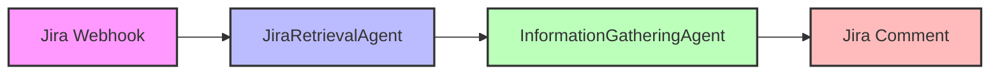

# Implementation Plan for Jira A2A Workflow

## Overview
This document outlines the implementation plan for a DevOps workflow using the tRPC-A2A-Go framework. The workflow consists of independent Go agents that communicate via A2A messages, with each agent implementing the standard TaskProcessor interface.

## System Architecture



## Implementation Phases

### Phase 1: InformationGatheringAgent Implementation

1. **Project Setup**
   - Initialize Go module
   - Set up directory structure
   - Add necessary dependencies

2. **Agent Implementation**
   - Create InformationGatheringAgent struct implementing TaskProcessor interface
   - Implement Process() method to handle "ticket-available" tasks
   - Set up Jira API client for fetching ticket details and posting comments
   - Implement status tracking via TaskHandle
   - Configure agent authentication (JWT/API-key)

3. **Server Configuration**
   - Set up A2A server using server.NewA2AServer
   - Define AgentCard with name, URL, version, and capabilities
   - Configure server port and authentication

4. **Testing Infrastructure**
   - Create main.go for demonstration
   - Implement client code using client.NewA2AClient
   - Create curl examples to simulate Jira webhook

### Phase 2: JiraRetrievalAgent Implementation (Future)

1. **Agent Implementation**
   - Create JiraRetrievalAgent struct implementing TaskProcessor interface
   - Implement webhook handler for Jira events
   - Implement Process() method to emit "ticket-available" tasks

2. **Server Configuration**
   - Set up A2A server for JiraRetrievalAgent
   - Define AgentCard
   - Configure server port and authentication

## Detailed Implementation Plan for InformationGatheringAgent

### Directory Structure
```
jira-a2a/
├── cmd/
│   ├── infogathering/
│   │   └── main.go
│   └── jiraretrieval/
│       └── main.go (future)
├── internal/
│   ├── agents/
│   │   ├── infogathering.go
│   │   └── jiraretrieval.go (future)
│   ├── jira/
│   │   └── client.go
│   └── config/
│       └── config.go
├── pkg/
│   └── models/
│       └── models.go
├── go.mod
├── go.sum
├── README.md
└── implementation.md
```

### Implementation Details

#### 1. InformationGatheringAgent

**Responsibilities:**
- Consume "ticket-available" tasks
- Fetch full Jira ticket details (description, acceptance criteria, links, etc.)
- Post a comment on the Jira ticket with a summary of gathered information
- Emit an "info-gathered" message with collected data

**Implementation Steps:**
1. Create a struct that implements the TaskProcessor interface
2. Implement the Process() method to:
   - Parse the incoming "ticket-available" task
   - Call Jira API to fetch ticket details
   - Analyze the ticket for missing fields
   - Post a comment to the Jira ticket
   - Update task status using TaskHandle
   - Emit "info-gathered" message

#### 2. Jira Client

**Responsibilities:**
- Authenticate with Jira API
- Fetch ticket details
- Post comments to tickets

**Implementation Steps:**
1. Create a Jira client struct
2. Implement authentication methods
3. Implement methods for:
   - Fetching ticket details
   - Posting comments
   - Retrieving linked tickets

#### 3. Main Application

**Responsibilities:**
- Start the A2A server
- Configure the InformationGatheringAgent
- Provide a demo client for testing

**Implementation Steps:**
1. Create main.go that initializes the A2A server
2. Configure the server with the InformationGatheringAgent
3. Set up authentication
4. Include a demo client that sends a "ticket-available" task

#### 4. Testing

**Test Cases:**
1. Receiving a valid "ticket-available" task
2. Handling missing or malformed task data
3. Dealing with Jira API errors
4. End-to-end test with curl examples

## Timeline

1. **Week 1:** Project setup, InformationGatheringAgent implementation
2. **Week 2:** Jira client implementation, testing
3. **Week 3:** Documentation, refinement, and JiraRetrievalAgent (if time permits)

## Next Steps

After completing the InformationGatheringAgent:
1. Implement the JiraRetrievalAgent
2. Set up CI/CD pipeline for automated testing and deployment
3. Add monitoring and logging
4. Implement error handling and retry mechanisms
