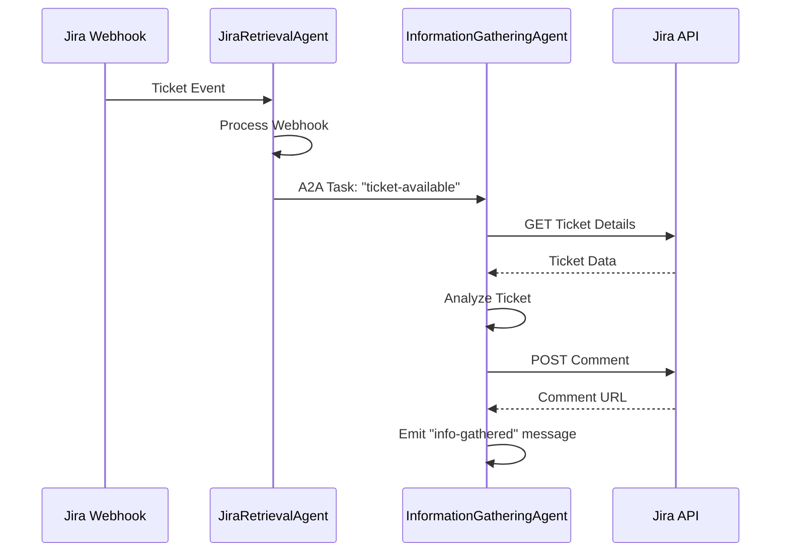
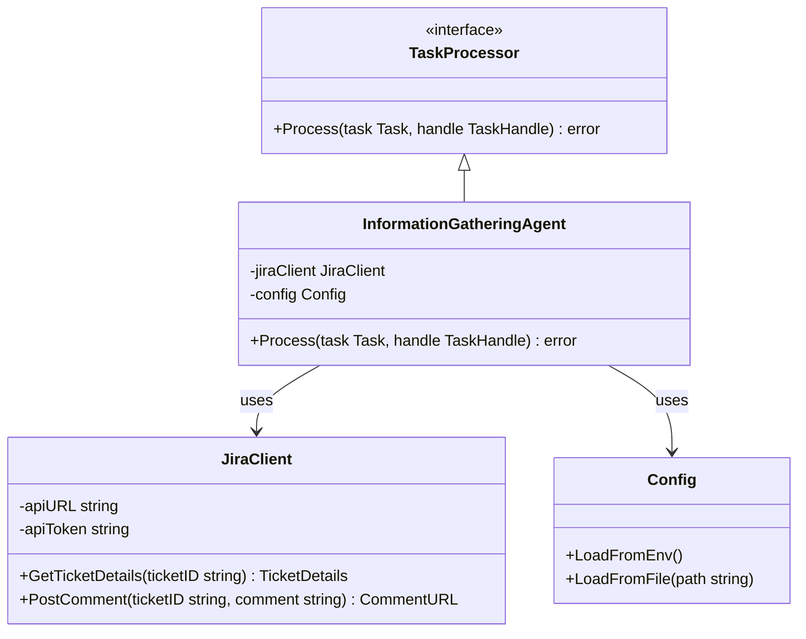
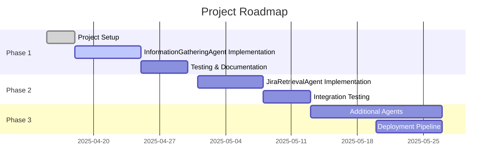
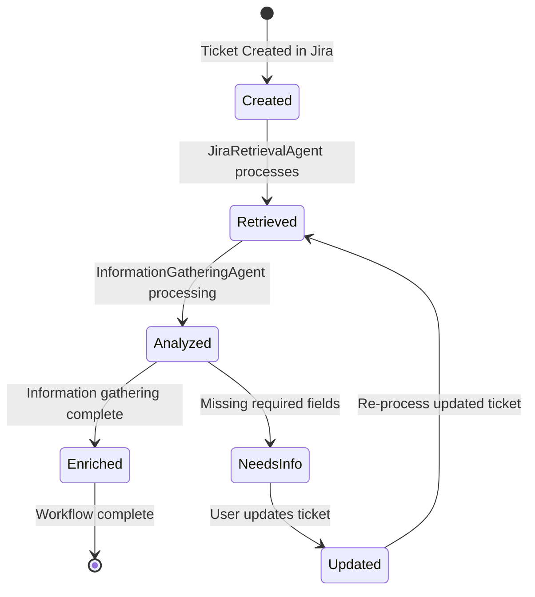

You are to implement a DevOps workflow as a set of independent Go agents using the tRPC-A2A-Go framework. Each agent implements the standard TaskProcessor interface and communicates via A2A messages. Begin by focusing on the InformationGatheringAgent:

1. JiraRetrievalAgent  
   • Listens for new JIRA–ticket webhooks.  
   • Emits a “ticket-available” A2A task with {TicketID, Summary, Metadata}.  

2. InformationGatheringAgent  
   • Consumes “ticket-available” tasks.  
   • Fetches the Jira ticket’s full description, acceptance criteria, any embedded links, linked tickets, and due date.  
   • Posts a comment back on the Jira ticket summarizing the gathered information and highlighting missing fields.  
   • Completes by emitting an “info-gathered” message containing {TicketID, CollectedFields, CommentURL}.  

Requirements for this step:  
- Use `server.NewA2AServer` to start the InformationGatheringAgent on its own port.  
- Define a clear AgentCard (name: “InformationGatheringAgent”, URL, version, capabilities).  
- Secure the agent with JWT or API-key authentication.  
- In `Process()`, call the Jira REST API to GET ticket details and to POST a comment.  
- Use the TaskHandle to record status updates, and include the Jira comment link as an artifact.  
- Provide a `main.go` that starts the server and demonstrates sending a “ticket-available” task via `client.NewA2AClient`.  
- Include instructions or a `curl` example to simulate a Jira webhook and observe the comment being added.

# Jira A2A Workflow

This project implements a DevOps workflow using the tRPC-A2A-Go framework. It consists of independent Go agents that communicate via A2A messages, with each agent implementing the standard TaskProcessor interface.

## Current Implementation

The current implementation focuses on the InformationGatheringAgent:

1. **InformationGatheringAgent**
   - Consumes "ticket-available" tasks
   - Fetches the Jira ticket's full description, acceptance criteria, embedded links, linked tickets, and due date
   - Posts a comment back on the Jira ticket summarizing the gathered information and highlighting missing fields
   - Completes by emitting an "info-gathered" message

## Project Structure

```
jira-a2a/
├── cmd/
│   └── infogathering/
│       ├── main.go
│       └── client_example.go
├── internal/
│   ├── agents/
│   │   └── infogathering.go
│   ├── jira/
│   │   └── client.go
│   └── config/
│       └── config.go
├── pkg/
│   └── models/
│       └── models.go
└── implementation.md
```

## Using Mermaid Diagrams

This project uses Mermaid diagrams for visualizing workflows and architecture. Mermaid lets you create diagrams and visualizations using text and code.

### Viewing Diagrams

To view the diagrams in this project:

1. **GitHub**: Mermaid diagrams in markdown files are automatically rendered when viewed on GitHub.

2. **VS Code**: Install the "Markdown Preview Mermaid Support" extension to see diagrams in the VS Code preview.

3. **Command Line**: Use the `@mermAId` command to:
   - Generate a new diagram: `@mermAId /create [diagram-type]`
   - Edit an existing diagram: `@mermAId /edit [file-path]`
   - Get help: `@mermAId /help`

### Diagram Types

- **Flowcharts**: `flowchart` or `graph`
- **Sequence Diagrams**: `sequenceDiagram`
- **Class Diagrams**: `classDiagram`
- **Entity Relationship Diagrams**: `erDiagram`
- **Gantt Charts**: `gantt`
- **State Diagrams**: `stateDiagram-v2`

For more information, visit the [Mermaid Documentation](https://mermaid.js.org/intro/).

## Process Flow

The diagram below illustrates the sequence of interactions between the Jira, agents, and other components:



## Data Flow

This diagram shows how data flows through the system:

```mermaid
flowchart TD
    subgraph Jira
        JT[Jira Ticket]
        JW[Webhook]
        JC[Comments]
    end
    
    subgraph "A2A Agents"
        JRA[JiraRetrievalAgent]
        IGA[InformationGatheringAgent]
    end
    
    JT -->|Update| JW
    JW -->|Notification| JRA
    JRA -->|"ticket-available"| IGA
    IGA -->|GET| JT
    IGA -->|POST| JC
    IGA -->|"info-gathered"| Future[Future Agents]
    
    style Jira fill:#f5f5f5,stroke:#333,stroke-width:1px
    style "A2A Agents" fill:#e6f7ff,stroke:#333,stroke-width:1px
```

## Component Structure

The component architecture of the system:



## Development Roadmap



## Ticket Lifecycle State Diagram

This diagram shows the states a ticket goes through in the workflow:



## Installation
